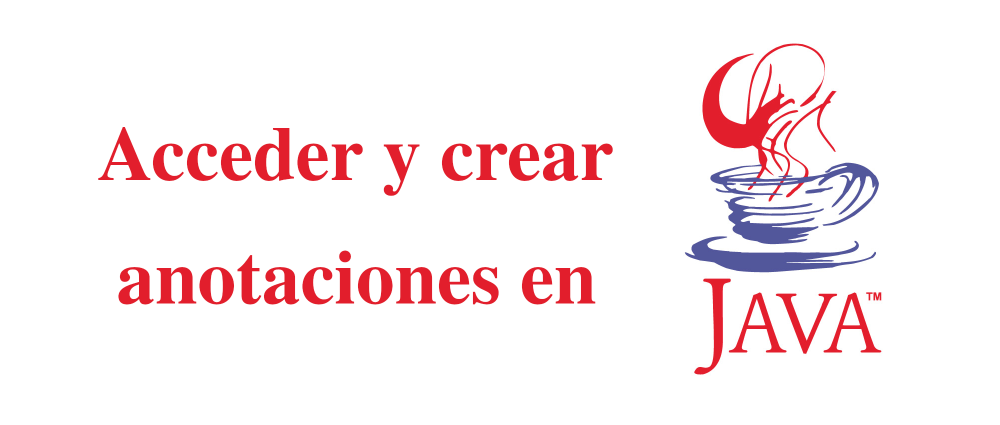

# Acceder y crear anotaciones en Java



Después de programar en Java por un tiempo seguramente se halla encontrado e incluso escrito lineas de código que comienzan con una @ justo al declarar clases y métodos, estas se llaman anotaciones y son bastante mas útiles y practicas de lo que cree, veamos como.

## Anotaciones
Las anotaciones son la forma en que el lenguaje de programación Java nos permite almacenar información sobre una parte de nuestro programa, sean métodos o clases, esta información puede usarse en tiempo de compilación o de ejecución para indicar como usar esa parte del código.

Un ejemplo del uso de anotaciones es la anotación @Deprecated esta es usada para que el compilador de Java el advierta que esta usando un método que ya esta obsoleto de modo que pueda decidir si usarlo o no.

Otro ejemplo es el framework Hibernate el cual usa anotaciones para relacionar una tabla en base de datos y sus campos con una clase Java y sus miembros, de modo que al consultar la base de datos automáticamente los registros obtenidos se conviertan en objetos del tipo correcto con los valores de los campos almacenados donde corresponde.

Esta capacidad de básicamente poder almacenar información sobre la clase o función y leerla en tiempo de ejecución para tomar decisiones sobre como usar esa clase o que datos almacenar puede ser bastante útil y permitirle diseñar sistemas que pueden extenderse y reusarse con facilidad, por lo que bien vale la pena aprender a usarla, cosa que veremos a continuación.

## Usando anotaciones
Para usar una anotación basta con colocar un @, la anotación que deseamos usar y, si tiene, los valores de cada elemento de esa anotación antes de declarar la clase, campo o método que deseamos tenga esa anotación, puede poner cuantas anotaciones desee como se ve a continuación

```java
@Anotacion(elemento="informacion del elemento", orden=1)
@Override
@SuppressWarnings("unchecked")
public void metodoAnotado() {
...
}
```

Ahí por ejemplo puede ver que le pusimos tres anotaciones a un método, una anotación con dos elementos, uno que almacena texto y otro que almacena un numero, la anotación Override que es usada por el compilador y la anotación SupressWarnings con un elemento de texto

Los “elementos” que mencionamos previamente son información almacenada por la anotación de *esa* clase/método/miembro, de modo que la misma clase anotación puede ser usada en diferentes partes de su programa con información diferente, estos se agregan en la forma (elemento1=<valor>, elemento2=<valor>, ..) una anotación puede tener tantos elementos como desee.

Esta misma sintaxis aplica para clases y miembros solo recuerde que las anotaciones se aplicaran a la declaración inmediatamente despumes, por lo que considere eso al escribir su código.

## Obteniendo las anotaciones de una Clase
Primero veamos como obtener una anotación de una clase, para hacer esto necesitara del objeto Class de dicha clase y llamar al método .getAnnotation pasándole como argumento el objeto Class de la anotación que deseamos consultar, como se ve a continuación.

```java
Class c = ClaseConAnotacion.getClass();
Anotacion a = (Anotacion) c.getAnnotacion(Anotacion.getClass());
```

Notara que se ocupa hacer un casting del resultado de .getAnnotation al tipo de anotación que desea consultar, recuerde hacer esto o no podrá acceder a los elementos de la anotación.

El el caso de que la clase/miembro/método no contenga la anotación indicada se regresa un objeto nulo.

## Consultando los elementos de la anotación
El obtener la anotación tiene dos usos principales, ya sea ver que exista y actuar en forma acorde y consultar la información en los elementos que contiene, esto ultimo es muy útil si hay alguna forma de información relacionada con esa clase/método/miembro que desee tener a la mano en tiempo de ejecución, como saber en que miembro almacenar un campo de base de datos o que URL va a manejar una clase Servlet.

Como puede ver en el ejemplo de código anterior, la declarar una anotación puede especificar la información de los miembros como se ve a continuación

```java
@Anotacion(elemento="informacion del elemento", orden=1)
```

Entre los paréntesis pusimos que valor debe contener cada elemento, ¿Como los recuperamos?, una vez que tenga el objeto anotación adecuado basta con llamar el elemento deseado como se ve a continuación.

```java
anotacion.elemento(); // regresa el contenido de elemento
anotacion.orden(); // regresa el valor de orden
```

Aquí hay dos detalles que enfatizar, primero los elementos de las anotaciones no siguen la usual convención de get/set de los objetos Java ya que no se deben usar como objetos Java regulares.

Y segundo hacer el casting al tipo de anotación adecuado es vital si desea acceder a los elementos, ya que si no lo hace el objeto resultante sera tipo Annotation y no podra acceder a los elementos, le enviara un error al compilar.

## Creando su propia anotación
Ahora que sabemos como usar las anotaciones es hora de crear una a la medida que podamos usar para indicar lo que necesitemos y almacenar la información que deseemos .

Aquí es donde notara que las anotaciones no son como clases e interfaces usuales, ya que tienen sus propias convenciones, como puede ver en el siguiente ejemplo.

```java
// Indicamos en que contexto existira la anotacion
@Retention(RetentionPolicy.RUNTIME)
public @interface Anotacion {
    public String uso() default ""; // elemento uso
    public int orden() default 0; // elemento orden
}
```

Para empezar debe usar la anotación @Retention para indicarle al compilador donde mantener esa anotación, el elemento RetentionPolicy indicara eso y puede tener los valores SOURCE para indicar que la anotación es solo para el código fuente, CLASS para que solo el compilador la vea y RUNTIME para que se mantenga durante la ejecución del programa.

El siguiente detalle que notara es que se declara como @interface, no hay mucho que decir sobre esto, esa es sintaxis que se usa.

Por ultimo notara que los elementos no se declaran como funciones, con () al frente en lugar y la opción de especificar un valor por defecto.

## Ejemplo
Ok, suficiente de teoría, veamos un ejemplo que use todo lo que mencionamos, crearemos una anotación nueva con elementos, la aplicaremos a varias clases y en tiempo de ejecución recuperaremos esa información, no es tan complicado como suena, pero si usa varias clases, aquí están.

### Anotacion.java
```java
package mx.hashblog.ejemploAnotaciones.anotaciones;

import java.lang.annotation.Retention;
import java.lang.annotation.RetentionPolicy;

// Indicamos en que contexto existira la anotacion
@Retention(RetentionPolicy.RUNTIME)
public @interface Anotacion {
    public String uso() default ""; // elemento uso y su valor por defecto
    public int orden() default 0; // elemento orden y su valor por defecto
}
```

### Datos.java
```java
package mx.hashblog.ejemploAnotaciones.clases;

import mx.hashblog.ejemploAnotaciones.anotaciones.Anotacion;

@Anotacion(uso="Clase para datos", orden=1)
public class Datos {
    private Integer campo;
    private String texto;
    private Double decimal;

    /**
     * @return the campo
     */
    public Integer getCampo() {
        return campo;
    }

    /**
     * @param campo the campo to set
     */
    public void setCampo(Integer campo) {
        this.campo = campo;
    }

    /**
     * @return the texto
     */
    public String getTexto() {
        return texto;
    }

    /**
     * @param texto the texto to set
     */
    public void setTexto(String texto) {
        this.texto = texto;
    }

    /**
     * @return the decimal
     */
    public Double getDecimal() {
        return decimal;
    }

    /**
     * @param decimal the decimal to set
     */
    public void setDecimal(Double decimal) {
        this.decimal = decimal;
    }
}
```

### Empleados.java
```java
package mx.hashblog.ejemploAnotaciones.clases;

import mx.hashblog.ejemploAnotaciones.anotaciones.Anotacion;

@Anotacion(uso="Clase para empleados", orden=2)
public class Empleados {
    private String nombre;
    private Integer numeroEmpleado;
    private String posicion;    
}
```

### ManejoDatos.java
```java
package mx.hashblog.ejemploAnotaciones.clases;

import mx.hashblog.ejemploAnotaciones.anotaciones.Anotacion;

@Anotacion(uso="Clase para manejar datos", orden=3)
public class ManejoDatos {
    public void calcular(Datos dato) {
        
    }
    
    public void reporteEmpleado(Empleados empleado){        
    }    
}
```

### EjemploAnotaciones.java
```java
package mx.hashblog.ejemploAnotaciones;

import java.util.ArrayList;
import mx.hashblog.ejemploAnotaciones.anotaciones.Anotacion;
import mx.hashblog.ejemploAnotaciones.clases.Datos;
import mx.hashblog.ejemploAnotaciones.clases.Empleados;
import mx.hashblog.ejemploAnotaciones.clases.ManejoDatos;

public class EjemploAnotaciones {
    static public void main(String[] args){
        System.out.println("Obtenemos los objetos class de nuestras clases");
        Class claseDatos = Datos.class;
        Class claseEmpleados = Empleados.class;
        Class claseManejoDatos = ManejoDatos.class;
        
        ArrayList<Class> clases = new ArrayList<>();
        
        clases.add(claseManejoDatos);
        clases.add(claseEmpleados);
        clases.add(claseDatos);
        
        for(Class clase : clases){
            System.out.println("Obteniendo anotacion de la clase: " + clase.getName() );
            Anotacion anotacion = (Anotacion) clase.getAnnotation( Anotacion.class );
            
            System.out.println("Obtenemos los datos que pusimos en las anotaciones");   
            System.out.println("Clase: " + clase.getName());
            System.out.println("Uso  : " + anotacion.uso());
            System.out.println("Orden  : " + anotacion.orden());
            System.out.println("");            
        }
    }
}
```

Que cuando lo ejecute le dará la siguiente salida:

```
Obtenemos los objetos class de nuestras clases
 Obteniendo anotacion de la clase: mx.hashblog.ejemploAnotaciones.clases.ManejoDatos
 Obtenemos los datos que pusimos en las anotaciones
 Clase: mx.hashblog.ejemploAnotaciones.clases.ManejoDatos
 Uso  : Clase para manejar datos
 Orden  : 3
 Obteniendo anotacion de la clase: mx.hashblog.ejemploAnotaciones.clases.Empleados
 Obtenemos los datos que pusimos en las anotaciones
 Clase: mx.hashblog.ejemploAnotaciones.clases.Empleados
 Uso  : Clase para empleados
 Orden  : 2
 Obteniendo anotacion de la clase: mx.hashblog.ejemploAnotaciones.clases.Datos
 Obtenemos los datos que pusimos en las anotaciones
 Clase: mx.hashblog.ejemploAnotaciones.clases.Datos
 Uso  : Clase para datos
 Orden  : 1
```

En el ejemplo puede ver varias cosas, primero como obtener las anotaciones vía el objeto Class, después como consultar los elementos y que el contenido de esos elementos podemos tratarlo como cualquier valor en Java, presentándolo en pantalla y comparándolo.

El código del ejemplo puede encontrarlo aquí: https://gitlab.com/ticomWebcomic/anotaciones

Esta entrada es tal vez mas teoretica de lo normal, pero creame el poder almacenar información que puede consultar en tiempo de ejecución dentro de las clases y métodos es una herramienta que le deja hacer cosas muy interesante ;).

